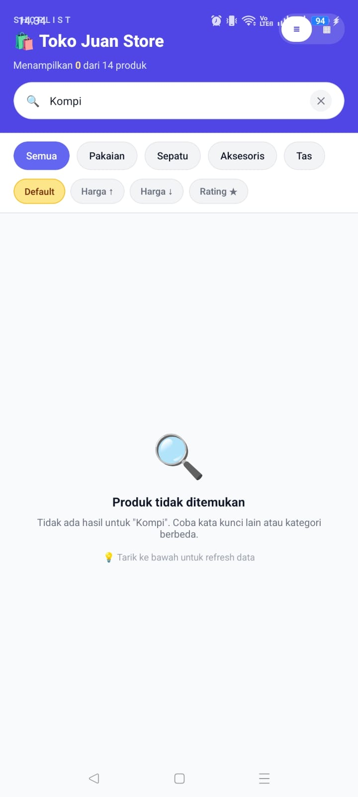
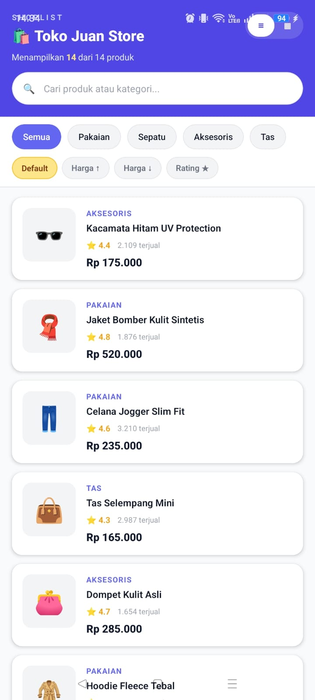
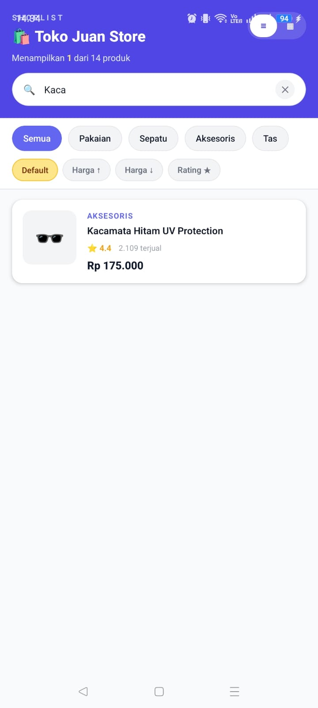

# ShopList App - Pemrograman Mobile Pertemuan 6

## Nama & NIM
- Nama: JUAN MOSES TAMBUNAN
- NIM:  243303621215

---

## 🚀 Fitur yang Diimplementasikan
- [x] FlatList dengan 12+ produk
- [x] Custom ProductCard component (file terpisah)
- [x] keyExtractor dengan ID unik
- [x] ListEmptyComponent (empty state)
- [x] Search / Filter real-time
- [x] Pull-to-Refresh
- [ ] Filter Kategori (E1)
- [ ] Toggle List/Grid View (E2)
- [ ] SectionList Mode (E3)
- [ ] Sort Produk (E4)

---

## 📱 Screenshot

### Tampilan Utama (List Produk)


### Tampilan Search — saat ada hasil


### Tampilan Empty State — saat tidak ada hasil


---

## ⚙️ Cara Menjalankan
1. Clone repository:
   ```bash
   git clone [url-repo-kamu]
